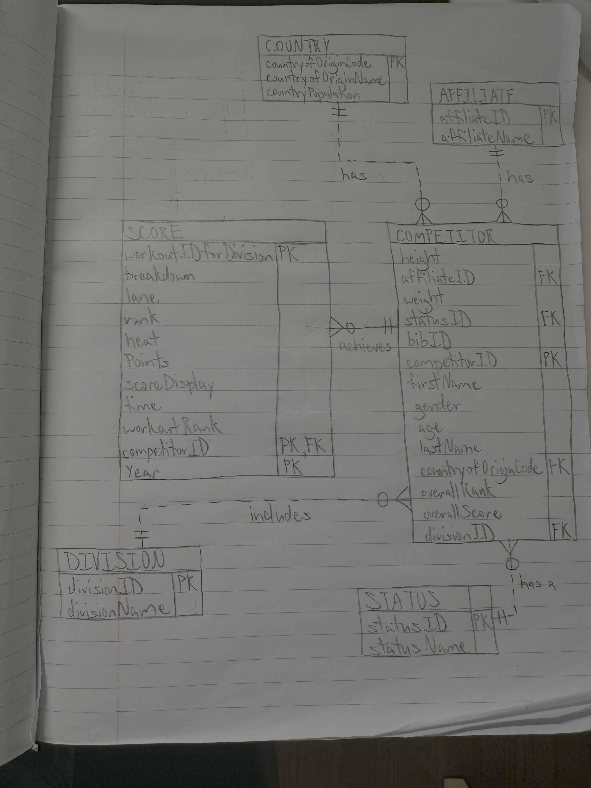

# SQL-Crossfit-Database-Project

## 1. Project Summary
This project involved designing and building a relational database from raw, flat-file CSV data. The goal was to take messy, redundant data, normalize it to the Third Normal Form (3NF), build a clean schema in MySQL, and then write SQL queries to answer business questions.

This demonstrates a full-stack data workflow: from raw CSVs, to a scripted data-cleaning and import (ETL) process, to a final, query-ready relational database.

---

## 2. Database Design & Normalization

To build a stable and efficient database, I first analyzed the raw data and defined the business rules and functional dependencies.

### Functional Dependencies
ComptetitorID -> FirstName, Gender, Age, LastName, OverallRank, OverallScore, Division, Weight
AffiliateID -> AffiliateName
CountryOfOriginCode -> CountryOfOriginName, CountryPopulation
workoutIDforDivision -> breakdown, lane, rank, heat, points, time

### Normalization to 3NF
1NF: 
SCORE (workoutIDforDivision, breakdown, lane, rank, heat, Points, scoredisplay, time, workoutrank, competitorid, Year)
COMPETITOR (height, affiliateid, countryoforiginname, weight, affiliatename. Status, bibid, competitorid, firstname, gender, age, lastname, countryoforigincode, overallrank, overallscore, division, countrypopulation)

2NF: 
SCORE (workoutIDforDivision, breakdown, lane, rank, heat, Points, scoredisplay, time, workoutrank, competitorid, Year)
COMPETITOR (height, affiliateid, countryoforiginname, weight, affiliatename. Status, bibid, competitorid, firstname, gender, age, lastname, countryoforigincode, overallrank, overallscore, division, countrypopulation)
NO PARTIAL DEPENDENCIES

3NF: 
SCORE (workoutIDforDivision, breakdown, lane, rank, heat, Points, scoredisplay, time, workoutrank, competitorid, Year)
COMPETITOR (height, affiliateid, weight, Status, bibid, competitorid, firstname, gender, age, lastname, countryoforigincode, overallrank, overallscore, division)
COUNTRY(countryoforigincode, countryoforiginname, countrypopulation)
AFFILIATE(affiliateid, affiliatename)

### Architectural Improvements
SCORE (workoutIDforDivision, breakdown, lane, rank, heat, Points, scoredisplay, time, workoutrank, competitorid, Year)
COMPETITOR (height, affiliateid, weight, statusID, bibid, competitorid, firstname, gender, age, lastname, countryoforigincode, overallrank, overallscore, divisionID)
COUNTRY(countryoforigincode, countryoforiginname, countrypopulation)
AFFILIATE(affiliateid, affiliatename)
DIVISION(divisionID, divisionName)
STATUS(statusID, statusName)

---

## 3. The Final Database ERD

---

## 4. How to Use

This repository shows the full "before" and "after" of the data.

1.  **The "Before":** See the raw `Crossfit Athletes.csv` and `Crossfit Scores.csv` files.
2.  **The "Solution":** The `Crossfit_ETL_and_Queries.sql` script is the complete ETL and query script.
3.  **The "After":** The ERD shows the final, 7-table normalized structure.
4.  **The "Fix":** The `crossfit_athletes_import_fix.sql` script is a custom-built loader to help if facing trouble importing the `Crossfit Athletes.csv` file

**How to run this project:**
1.  Create a new MySQL schema (e.g., `crossfit`).
2.  Use the MySQL Table Data Import Wizard to import `Crossfit Athletes.csv` (as `crossfit_athletes`) and `Crossfit Scores.csv` (as `crossfit_scores`).
3.  If having difficulties importing `Crossfit Athletes.csv`, run the `crossfit_athletes_import_fix.sql` script in a new query.
5.  Run the **`Crossfit_ETL_and_Queries`** script. This script will:
    * CREATE all 7 new, normalized tables (country, competitor, etc.).
    * INSERT and TRANSFORM the data into these new tables, handling all data cleaning (like NULLIF and LEFT JOINs).
    * DEFINE all Primary and Foreign Keys.
    * RUN 10+ analysis queries to answer the project's business questions.
